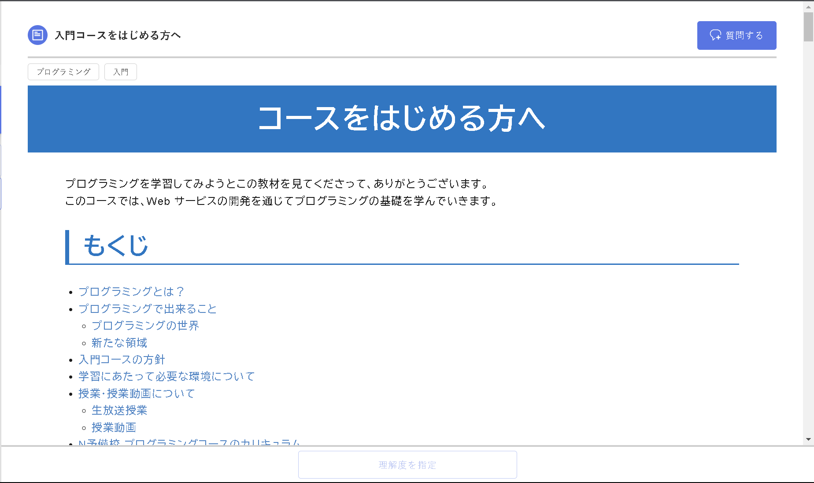
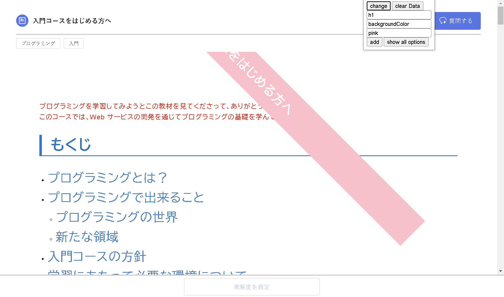
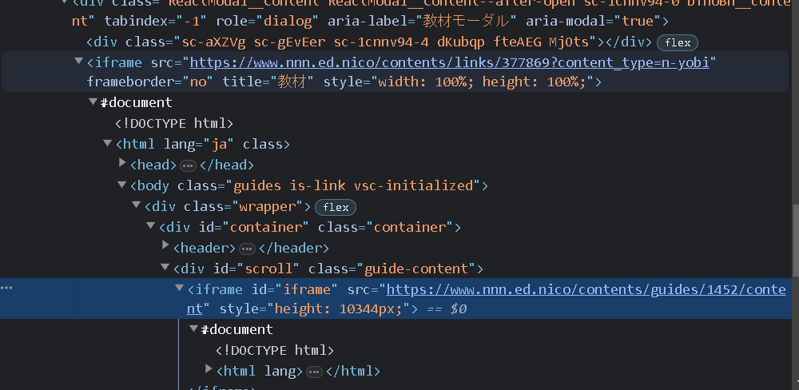

# Google_Chrome_Extension

## 概要
N予備校のコースの文章のスタイルを任意に変更する

## 画像
Before: 
After: 

## 出来ること
- 背景色や文字の色を変更する
- ```transform: rotate(45deg);```の様に回転させる

## 出来ない...と思ったら確認すること
- ```font-size```が効かない...→ちゃんと要素を指定できてないだけかも
  - ```h1```を指定してるけど，文字は```a```に書かれていたり
    - 一番最初の「第1章のはじめに」とかは```a```タグで文字が書かれてる

## めんどくさかったこと
- N予備校は普通にHTMLでいい感じに書かれてない
  - iframe内にiframeで書かれてる
  - そのため，```document.getElementsByTagName("iframe")[0].contentDocument.getElementsByTagName```のように要素を取得するために呪文を生成する必要があった
  
## 学んだこと
- 拡張機能の作り方
  - manifest.jsonをいい感じに書くと，あとは機能をつけるだけ
- Chromeのストレージ
  - local, sync, sessionがある
- JSの同期処理はだるい
  - めっちゃネストになってしまった
  - きれいに書けるようになりたい